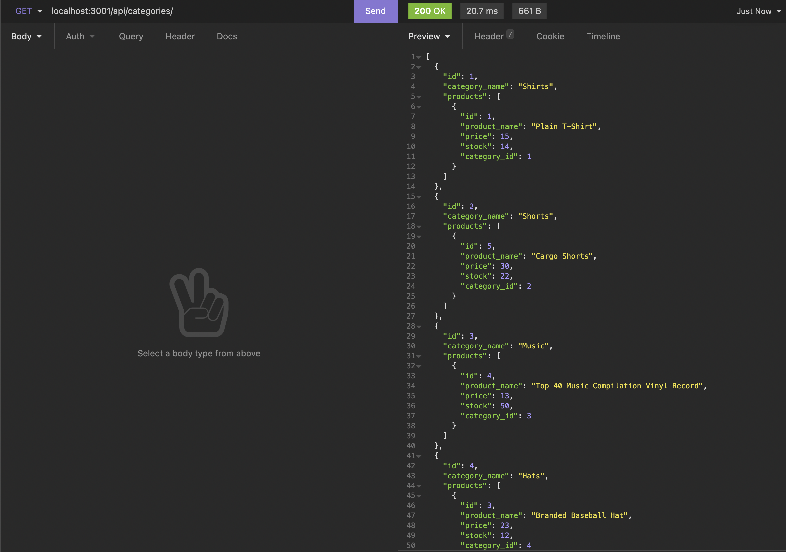

# ecommerce back end

## Description

Build out the back end for an e-commerce site by modifying starter code. Configure a working Express.js API to use Sequelize to interact with a MySQL database.

## Installation

Git clone this repository in your command line. Open an integrated terminal in Visual Studio or a similar application. Run 'npm i' for the main folder. Run 'npm run seed' to fill your database with data.

## Usage

Run 'npm start' to start the server. You can download insomnia to view your database as well as the GET, POST, PUT and DELETE routes.
 
Video Link: 
 
 

Screenshots
 
 
GET Category 

 
 
GET Category by ID 

 
 
POST Category 

 
 
PUT Category 

 
 
DELETE Category 

## Credits

Used information from Week 13 mini project.

## How to Contribute

Add more information for the products like a description  